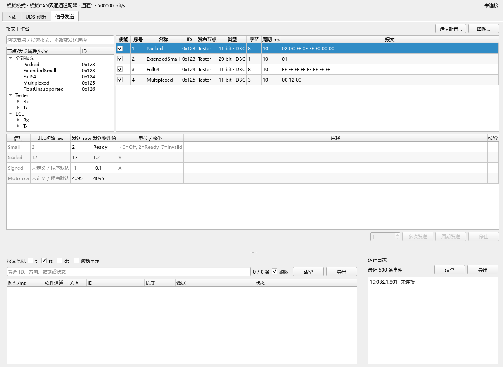
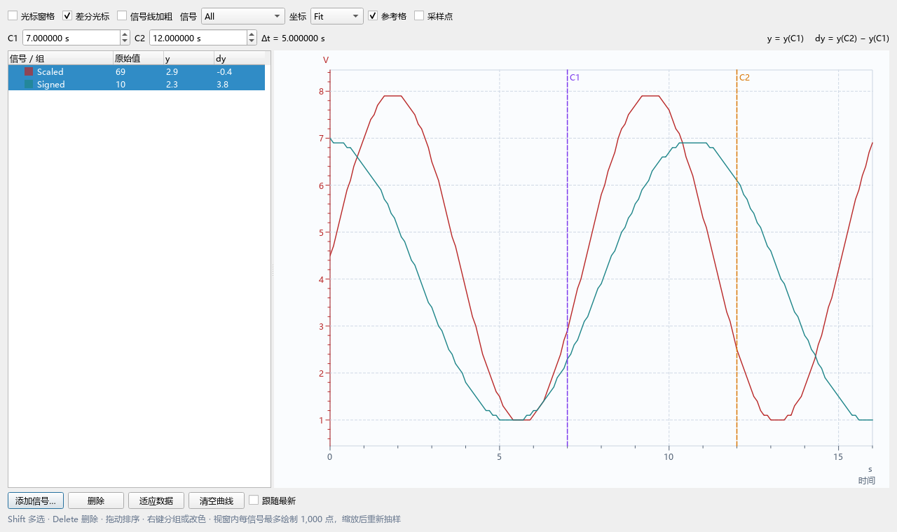
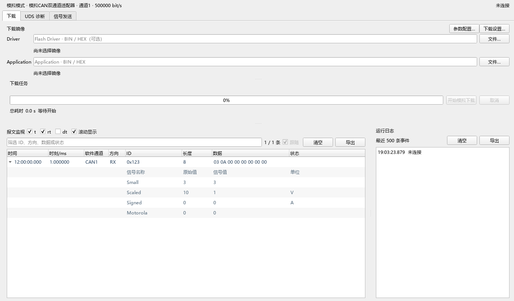

<div align="center">

# Qt-GeneralController

**CAN / LIN 信号、报文与诊断工作台**

简体中文 · [English](README.en.md)


[](LICENSE)

从数据库信号编辑，到报文监视、日志回放和图像观测，在同一工作台完成，基于Codex。

[快速上手](#快速上手) · [使用说明](docs/User-Guide.md) · [1.4 更新](docs/Release-1.4.md) · [许可说明](docs/Licensing.md)

</div>

## V1.4 交互更新

主标题右侧通过 **简中 / Eng** 即时切换界面语言，记住上次选择；数据库名称、枚举名称和用户输入保留原文。待发送报文、待发送帧及信号表支持拖动表头调整列顺序、拖动边界调整列宽，并随项目配置保存；发送 raw / 物理值单击即可编辑。枚举下拉支持文本输入、自动补全与 Tab 接受补全；原始值可设为枚举表以外的值，未定义枚举显示“-”。

图像 arrange 布局在当前窗口高度内显示所有曲线，枚举 Y 轴按缩放生成刻度与参考格，命中枚举的刻度及左侧 y 列显示枚举名称。报文 rt 保留六位小数，以毫秒显示（例如 `1200123.674 μs → 1200.123674 ms`）。

## 功能一览

| 模块 | 能力 |
| --- | --- |
| **多通道管理** | CAN / LIN 软件通道、模拟与在线模式、硬件绑定、独立任务、项目配置保存与退出变更提示。 |
| **数据库与信号发送** | DBC / LDF 导入；原始值、物理值和枚举编辑；无数据库时新建 CAN 报文、LIN 调度与帧；ID 编辑、默认值同步、多次及周期发送/调度。 |
| **报文监视** | t / rt / dt 列显隐、筛选、跟随、按 ID 原位更新；半字节变化着色；数据库信号展开；最多显示最近 10,000 条记录。 |
| **日志导出与回放** | ASC / BLF / CSV 导出；ASC / BLF 导入回放；日志通道多对一或多目标映射；使能报文覆盖及日志外报文追加。 |
| **图像观测** | 多信号、分组与拖动排序；All / Marked / GrayNoMarked；Fit / arrange / All 坐标布局；双光标差值、枚举刻度、网格、缩放与保形抽样。 |
| **UDS 与下载** | CDD 导入、ECU / Variant 选择、服务参数及请求生成；CAN / LIN 模拟下载；可配置的 LIN 在线下载流程与外部安全访问接口。 |

**数据库兼容性：** DBC / LDF 支持 UTF-8 和 Windows 下的 GBK / GB18030 文件；CDD 已验证至 CANdela 16.x，更高版本按现有解析规则尝试读取，成功时警告，解析失败时报错。提供本地数据库逐文件导入、定义清单比对及编解码回归工具，详见 [数据库导入验证](docs/Database-Import.md)。

## 界面预览

以下截图使用模拟通道和合成信号，展示 V1.3 界面，不代表真实 ECU 测试结果。

### 信号工作台

按节点和报文浏览数据库，编辑待发送数据，配置发送次数和周期。



### 图像观测

对同一信号的两个光标值计算差分，多信号独立计算。每条信号最多绘制 1,000 个采样点，缩放时按可见范围重采样；超过 5 秒未更新的相邻采样点不连线。



<details>
<summary><strong>展开查看报文监视与信号解析</strong></summary>



`t` 为系统时间，`rt` 为从记录开始起算的毫秒时刻，`dt` 为相邻记录时间差。默认仅显示 `rt`；“滚动显示”开启后按相同 ID 原位更新。

</details>

## 硬件与支持范围

| 场景 | V1.4 范围 |
| --- | --- |
| 模拟模式 | 无硬件即可使用模拟通道；日志尽可能快速重现，保留 Sim Tx / Sim Rx 区分。 |
| PEAK | PCAN / PLIN 后端；需要匹配的厂商驱动及 API。 |
| 同星 TOSUN | TC1016 / TC1016P 系列经典 CAN 与 LIN 适配；需要 TSMaster / libTSCAN 运行库。 |
| 真实硬件回放 | 原始 1 倍速；仅排除数据库明确属于当前节点的报文 ID；按人工映射选择参与通道。 |
| CAN FD | 日志读写和模拟回放可处理相关记录；当前不开放真实 CAN FD 收发。 |
| ECU 下载 | CAN 下载目前仅支持模拟；LIN 在线下载需实际目标参数及授权的安全访问算法。 |

**验证范围：** V1.4 已完成 Qt 5.15.19 / Qt 6.8.4 的 Release 构建，两套各 15 项验证通过；TC1016P 的 CAN1 / CAN2 外部回环已验证。真实 LIN ECU 收发尚未完成验收，模拟 SDK 结果不能替代实机验收。详见 [同星硬件适配](docs/Tosun-Hardware.md)。

## 快速上手

1. 启动程序目录中的 `QtBootloader.exe`，首次创建 CAN01 和 LIN01，不自动连接硬件。
2. 在通道配置中选择模拟模式，或选择已安装驱动的实际硬件及通道，设置波特率后连接。
3. 在“信号发送”页导入 DBC / LDF，选择报文或调度表，编辑值并使能发送项。
4. 使用“多次发送 / 多次调度”或周期模式，观察下方报文；点击“图像…”添加数据库信号。
5. 需要回放时，在通信配置中导入 ASC / BLF、设置通道映射；通过“保存项目配置”保存当前工程。

程序运行时不依赖 Python。源码中的公开配置与测试固件仅用于模拟；仓库不包含私有安全访问算法、真实 seed/key 向量或目标 ECU 配置。

## 从源码构建

需要 Windows x64、CMake / Ninja、匹配的 Qt / MinGW，以及定义 `peak_communication` 和 `peak_deploy` 的外部通信模块。CMake 按顺序查找：

```text
../Qt-ACTestController/resource/communication
../communication-provider/resource/communication
```

模块位于其他位置时，设置 `-DCOMMUNICATION_SOURCE_DIR=<模块目录>`。共享模块需包含项目使用的 LIN 扩展，见 [通信模块说明](docs/Communication-Module.md)。

```powershell
cmake --preset qt6
cmake --build --preset qt6
ctest --preset qt6
# Qt 5 使用 qt5
```

预设默认为 Release，并固定到原工程 `C:/Documents/0_Qt/Qt-GeneralController` 对应的工具链和输出路径。其他机器需调整 `CMakePresets.json` 的路径。首次配置获取固定版本的 dbcppp / Boost；离线依赖配置见 [构建实施记录](docs/Signal-Transmission-Implementation.md)。

### 程序与构建内容分离

```text
../build/
├── Qt-GeneralController-qt5/          # Qt 5 主程序与必要运行依赖
├── Qt-GeneralController-qt6/          # Qt 6 主程序与必要运行依赖
└── qttemp/
    ├── Qt-GeneralController-qt5/      # 缓存、中间文件、tests、调试工具及日志
    └── Qt-GeneralController-qt6/      # Qt 6 独立构建与测试内容
```

路径不随 worktree 改变；同一构建目录不应被不同检出同时使用。不在源码目录创建 build。`-DBUILD_TESTING=OFF` 可仅构建主程序；自定义程序位置使用 `HOST_RUNTIME_OUTPUT_DIR`，CMake `-B` 仍应放在 `../build/qttemp` 中。

必要的 Qt / MinGW DLL、插件和硬件 API 应与 EXE 一起保留。测试程序、模拟素材与缓存不进入运行目录。可选的 32 位安全访问桥接程序需显式设置 `BUILD_SEEDKEY_BRIDGE=ON` 和 `SEEDKEY_CXX32`；算法由使用者另行提供。

### 打包与独立验证

```powershell
cmake --build --preset qt6 --target package_release
ctest --preset qt6 -R release_runtime
```

发布副本、ZIP 和 SHA256 位于相应 `qttemp/Qt-GeneralController-qtN/release/` 下。打包不会覆盖已有目录，可用 `-DHOST_RELEASE_OUTPUT=<新目录>` 指定新路径。`VerifyRelease.exe` 留在 `qttemp` 的 tests 目录，通过 `HOST_RELEASE_DIR` 可指定另一份发布副本进行启动验证。

## 文档导航

| 文档 | 内容 |
| --- | --- |
| [使用说明](docs/User-Guide.md) | 通道配置、信号发送、诊断与下载操作 |
| [报文与图像观测](docs/Trace-and-Graphics.md) | 时间列、导出、曲线、光标与采样规则 |
| [工作台与回放](docs/Signal-Workbench-Replay.md) | CAN / LIN 编辑、发送次数、映射与覆盖 |
| [CDD / UDS](docs/CDD-UDS.md) | 数据库诊断服务与参数 |
| [1.4 发布说明](docs/Release-1.4.md) | 主要更新、验证结果与边界 |
| [逻辑修复记录](docs/Logic-Review-Fixes.md) | 定版前问题与回归验证 |
| [MVVM 检查](docs/MVVM-Audit.md) | 架构职责与调整记录 |

## 许可证

项目自有代码采用 **LGPL-3.0-only**，沿用仓库已有 LGPL v3 许可方向。完整文本见 [LICENSE](LICENSE)，其引用的 GPL v3 条款见 [LICENSE.GPL](LICENSE.GPL)。第三方代码、运行库和厂商 SDK 保留各自许可，不因本项目许可证而被重新授权；范围及来源见 [许可与第三方组件](docs/Licensing.md)。
