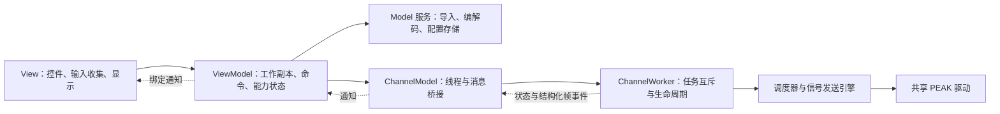

# MVVM 检查记录

日期：2026-09-18。范围：工作区中的下载、UDS 与新增信号发送页面，以及通道模型、配置和共享驱动衔接。

结论：当前实现保持 Qt Widgets 的 MVVM 职责分层。发现的反向依赖、View 直接调用业务编解码和配置存储等越界点已调整。此结论基于源代码检查、静态规则与软件回归；不等同于硬件时序验收，也不是所有组件都已采用依赖注入的声明。

## 职责与数据流



| 层 | 主要文件 | 边界 |
|---|---|---|
| Domain | `SignalTypes.h`、`HostTypes.h`、`ChannelDefaults.h` | 数据定义、状态、计划、快照；不依赖 View 或 ViewModel。 |
| Model 服务 | `DatabaseImporter`、`SignalCodec`、`SignalConfigurationStore`、`SettingsStore` | 解析、精确十进制、位编码、配置校验与文件操作；不调用控件。 |
| ViewModel | `SignalTransmitViewModel`、`SignalTableModels`、`ChannelConfigurationViewModel`、`DiagnosticDraftViewModel` | 管理草稿/已应用值/基准/撤销、能力状态；组织服务调用并生成线程间命令。 |
| View | `SignalTransmitPage`、通信和 UDS 参数对话框、`MainWindow` | 创建控件、选择文件路径、收集输入、呈现状态。业务校验与提交委托 ViewModel。 |
| 运行与基础设施 | `ChannelModel`、`ChannelWorker`、`SignalTransmitter`、CAN/LIN 调度器 | worker 串行操作驱动；UI 线程不直接访问 SDK。 |

Qt 的 `QAbstractItemModel` 名称不决定它属于业务 Model。`SignalTableModels` 适配 ViewModel 的编辑状态与显示规则，因此放在 `viewmodels`；原有仅持有数据的表格模型可以留在 `model`。

## 已修正项

1. `HostTypes` 原先包含 View 的默认值头文件。默认值移至 Domain，旧 View 头保留兼容转发。
2. 信号表格模型原先放在 Model 层，却依赖 `SignalTransmitViewModel`。已移至 ViewModel 层，消除反向依赖。
3. 信号 ViewModel 的配置读写提取为 `SignalConfigurationStore`。源数据库导入、配置恢复所需的数据库解析在后台执行，完整结果返回后一次应用。
4. `MainWindow` 原先直接调用 `SettingsStore`。保存、载入、运行状态检查改由 `ChannelConfigurationViewModel` 处理。
5. `ChannelModel.h` 原先暴露 `ChannelWorker.h`，把 SDK 依赖传递给界面。改为前置声明，具体 worker 仅在实现文件中使用；测试按需显式包含依赖。
6. 信号页中的发布资格、LIN PID 和协议说明计算移至 ViewModel。LIN 默认实际节点选择也由 ViewModel 决定，角色变更会同步通知视图，修正下拉框显示旧状态的问题。
7. 旧 UDS View 直接加载 CDD、解析目标、导入通信参数和编码请求。以上行为移至 `DiagnosticDraftViewModel`，对话框仍使用独立草稿，取消不提交。

## 状态与线程验证

- 数据库定义通过 `QSharedPointer<const DatabaseDefinition>` 只读共享；TX 工作副本、最后有效 payload 与 RX 状态分别保存。
- UI 提交 `TxPlan` / `PayloadUpdate`，worker 不持有控件。更新包含运行与连接代次，旧启动和停止命令不能影响后续运行。
- 通道互斥在界面能力状态和 worker 协调器两处执行；开始普通总线发送前销毁空闲诊断会话及 TesterPresent 定时器。
- 状态恢复不自动发送；停止由 worker 返回状态确认。LIN 主节点切表先确认硬件断点并排空旧接收队列，再安装新表。
- 两套 Qt 完整回归各 10 个套件通过；随后对本次 UDS 边界调整和信号修正重跑受影响套件，结果通过。具体测试见实施记录。

静态检查命令：

```powershell
python scripts/check_mvvm_boundaries.py
```

检查覆盖下层对 View/ViewModel 的反向包含、界面对 SDK/worker 的直接依赖、View 的基础设施依赖及直接业务解析调用、ViewModel 创建 QWidget 等规则。规则检查不能代替代码审查或行为测试。

现有工程仍把多层源码编入一个 `bootloader_ui` 静态库，且 `ChannelModel` 作为线程桥接器直接组合 worker。它们不破坏当前 MVVM 数据流；后续若需要替换运行后端或独立测试更多基础设施，可进一步拆分构建目标和注入接口。

## V1.4 复核

语言目录与 Language 服务只用于显示转换，UiLanguageController 负责控件文本及动态弹窗，不重建页面或改写业务数据。表格列布局由 View 读取表头状态，经 SignalTransmitViewModel 的 uiSettings 随项目保存；列视觉位置不参与 ID、信号或负载寻址。编辑委托通过模型角色提交原始值/物理值，继续由 SignalCodec 校验并编码。图像枚举标签仅改变 y 列展示，差分保留数值计算；画布布局和刻度仍留在 View。硬件驱动、回放、调度层未增加界面依赖。

## V1.4.1 复核

运行状态刷新与发送草稿解耦，模型仅在可编辑状态变化时刷新相关展示；编辑器初始化后保留草稿，提交继续走 ViewModel 校验和 worker 负载更新。枚举刻度生成和文件路径导航封装在 View 中。在线诊断工具仅用于人工回环验收，不加入 CTest 或主程序依赖。


## V1.4.2 复核

文件对话框恢复为 View 层的原生 QFileDialog 调用，标题在调用前经 Language::text 翻译；移除 PathFileDialog 自绘类与应用 / 语言控制器中的全局禁用设置。路径选择结果继续交给既有 ViewModel 处理。时刻/ms 的去尾零处理留在 FrameTableModel，保留底层 captureUs / timeUs、硬件时间戳、协议与回放单位。原生桌面与硬件接收探针只构建在 qttemp，不进入 CTest 自动弹窗或程序发布目录。


## 报文监视后续修订

FrameTableModel 保留完整会话缓存，同时管理最多 10,000 条的显示窗口、暂停状态与历史位置；暂停不阻断 recorded 信号，图像和后台记录继续。ChannelPage 只绑定暂停控件和按比例定位的滚动条，导出继续由 TraceExporter 处理完整缓存。新增控件、统计、提示与秒单位表头接入现有 Language / UiLanguageController。时刻改用显式 relativeSeconds 数值与秒格式，采集线程仅提供数值 captureUs，不再将原始微秒塞进显示字符串；协议和回放单位不变。
