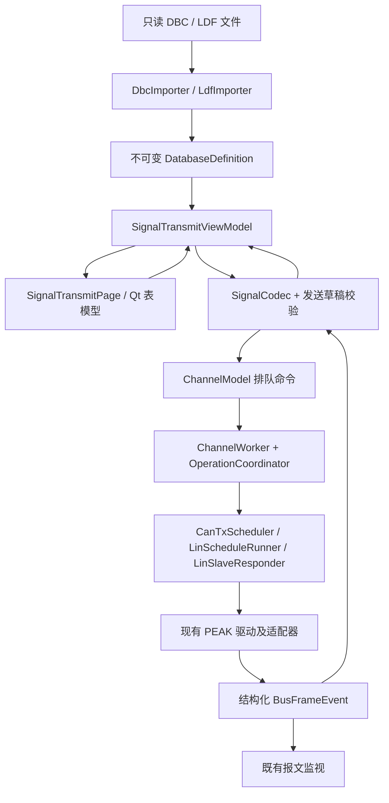

# DBC / LDF 信号发送页：调研、需求决策与实施方案

调研日期：2026-09-18。状态：需求规格第三稿，Q03 已确认：自建 CAN 帧始终按 ID 自动判型，不允许手工覆盖。当前已进入实现和软件验证，结果见 [实施与验证记录](Signal-Transmission-Implementation.md)；真实测试文件及实机数据仍待提供。

本文的调研部分依据原工作区代码编写，包含已有、尚未提交的 UDS/CDD 实现。没有以 Git HEAD 替代当前代码。以下第三方评估及“当前代码”表保留调研时的上下文；实际集成版本、构建结果与限制以实施记录为准。

## 1. 已确认事项与必须明确的术语

用户已明确：增加信号发送页；读取 DBC/LDF；列出节点、报文/帧及值；CAN 支持发送选择，LIN 支持调度表选择；源 DBC/LDF 不得更改。

用户已进一步确认：

- CAN 从 DBC 选择报文，编辑信号/数据，支持单次和周期发送。
- CAN 允许在发送前新建 DBC 不存在的报文；自建报文的数据仅编辑 raw，不定义信号或物理值。
- CAN 采用经典 CAN，支持 11/29 位 ID、0–8 字节。
- 互斥范围为单个软件通道；其任一任务运行时，其他任务页控件禁用并变灰，不同软件通道可以并行。
- LIN 一次只扮演一个主节点、一个具体从节点或监听节点。运行前可选择角色、实际节点和调度表；运行后角色/节点选择禁用变灰。
- LIN 主节点执行调度表；从节点仅在外部主节点发出其发布帧帧头后响应；监听节点不发布，运行中发布帧编辑区禁用变灰。
- LIN 主/从角色运行时可编辑所有帧的信号/raw 工作副本；只有当前节点拥有且属于所选调度表的发布帧参与当前发送/响应，其他帧的编辑只保存本地副本。从节点收到所选表以外的帧头不响应。
- LIN 停止时允许新建/删除整张调度表，增删/重排表内槽并修改 delay；槽只引用当前 LDF 已定义的帧。用户最新命名为“回退＝回退本页上一步编辑”“撤销＝本页全部配置恢复到最近读取的通信配置”；两按钮仅停止时可用。未读过配置时采用最近导入数据库后的状态；保存不改变基准，成功导入数据库/读取配置清空操作历史。
- LIN 运行中结构冻结。主节点切表必须等旧表完整执行当前一轮，新表从首槽开始；允许一次额外间隙，显示“切换中”并记录实际间隙，暂不设硬性上限。从节点切表先暂停响应、替换帧响应集合再恢复，允许短暂无响应并记录，不推测外部主节点轮次。原 LDF 不变。
- CAN/LIN 运行中数据在回车或失焦提交后生效，按整帧原子更新后续未提交的发送；自建 CAN 报文只改 raw，监听模式禁止编辑。
- “通信”按钮及二级界面参照现有下载/UDS 参数界面；初始值采用“默认值（只读）＋使用值（可编辑）”双列。信号有效位默认全 1（例如 3 位为 0x7、12 位为 0xFFF，数组逐字节 FF），CAN 未占用位为 0、LIN 未占用位为 1。只读列保持程序默认；DBC/LDF 文件初始值仅覆盖可编辑使用值，缺失时沿用程序默认。
- 超出数据库 min/max 但位宽可表示的值允许发送，以高亮底色提示。位宽溢出保留为错误草稿，继续发送上一有效值，不取低位、不饱和。物理值反解得到非整数 raw 时向零截断，显示实际物理值并提示量化差异。
- 增加子级“保存通信配置”“读取通信配置”；重启、重连和读取配置后均保持停止。
- 以通道设定波特率运行，不根据 LDF 改波特率；CAN 周期输入为整数毫秒且至少 1 ms，发送列表不设人为条数上限；超载提示、统计漏期、不积压补发。LIN 最短槽间隔按设定波特率、帧长度和硬件分辨率校验；实际周期误差在样本与硬件验收时测量。
- 自建 CAN 报文的标准/扩展类型始终根据 ID 自动判定，不允许手工覆盖；与当前通道全部 DBC 报文及全部自建报文按数值 ID 查重，不区分标准/扩展；重复时提示且不提交，等待修改。
- 保持原生 C++ 部署：DBC 复用 C++ 库，LDF 实现明确限定的语法并用开源库对照测试。
- 保留 Qt 5/6；共享通信模块纳入交付；实际 DBC/LDF 测试文件后续提供，硬件周期误差指标尚未给出。

以下术语用于后续实现和验收，不混用：

| 术语 | 定义 |
|---|---|
| 数据库定义 | 文件中的节点、帧 ID、长度、发布者、位布局、换算规则、枚举、属性、调度表等只读信息。 |
| 文件初始值 | 文件明确规定的信号初始值，包括具有明确语义的属性默认值；可以不存在。不是当前接收值。 |
| 程序默认值 | 信号有效位全 1，数组逐字节 FF；CAN 未占用位为 0、LIN 未占用位为 1。初始值界面的只读列不被文件初始值覆盖；它不是文件原始值。有符号信号的全 1 位模式按补码解释为 -1。 |
| 使用值 | 初始值二级界面的可编辑工作值：导入时先采用程序默认，文件定义可覆盖；之后与主界面的发送编辑值共用模型，不另建互相冲突的发送数据源。文件原值另行保留。 |
| 信号 raw | 从帧位域取得的未缩放值。整数同时支持十进制解释与十六进制位模式；有符号数按其位宽解释。 |
| 信号解析值 | 按文件换算得到的物理值、单位和枚举文本。LDF 还可能有分段换算、ASCII、BCD。无换算时明确显示“无换算定义”。 |
| 帧 raw | 仅指按线序排列的数据区字节，例如 `01 02 FF`；不包括 CAN ID、LIN PID 或 LIN checksum。后者单列。 |
| 帧解析值 | 帧内各信号解析后的集合，不把整帧强行解释为一个数字。 |
| 发送编辑值 | 用户准备发送的工作副本；与文件初始值、最近一次接收值分别保存。 |
| 已应用发送值 | 能够编码并已交给发送引擎的完整 payload 及修订号。物理范围越界可以带警告应用；编辑中间状态不得成为总线数据。 |
| 实际接收值 | 最近一条匹配数据库且有效的总线报文解码结果，带来源、时间和有效性。未收到时为“未接收”，不填假值。 |
| 单次发送 | 对选中报文各提交一次发送请求；与驱动接收请求、硬件发送回显、目标 ECU 已处理三个事件分别记录。 |
| 周期发送 | 各选中报文按各自周期持续提交，直到停止；不等同于播放历史报文。 |
| 节点浏览 | 查看发布者和订阅者关系，不改变正在模拟的节点。与 LIN 的实际角色/节点选择是不同控件。 |

DBC 的初始值可以不存在；cantools 也分别表示 `raw_initial`、物理初始值和缺失状态。按上述位规则补缺省后，仍须标明“程序默认”，不能称为文件原始值；缺失文件初始值不再成为发送阻断条件。[信号属性文档](https://cantools.readthedocs.io/en/latest/#cantools.database.can.Signal)

## 2. 当前代码与改造落点

| 已核实代码 | 对本功能的影响 |
|---|---|
| [CMakeLists.txt](C:/Documents/0_Qt/Qt-GeneralController/CMakeLists.txt:3)：C++17，Qt 5/6，Widgets，外部 `peak_communication`。 | 解析器应兼容两个 Qt 构建；引入依赖必须验证两套 MinGW 工具链。 |
| [ChannelPage.cpp](C:/Documents/0_Qt/Qt-GeneralController/src/views/ChannelPage.cpp:145)：每个软件通道内部有 `taskPages`，顺序为“下载”“UDS 诊断”。 | 建议将“信号发送”加为每通道第三个页签，共享顶部连接配置和底部报文监视。不是主窗口再增加一个软件通道。 |
| [ChannelPage.cpp](C:/Documents/0_Qt/Qt-GeneralController/src/views/ChannelPage.cpp:200)：布局比例仅区分下载和 UDS。 | 改为按任务页保存比例，给信号树和编辑表独立空间。 |
| [ChannelModel.cpp](C:/Documents/0_Qt/Qt-GeneralController/src/model/ChannelModel.cpp:7)：每通道独立 `QThread` 和 `ChannelWorker`。 | 发送和驱动调用继续在该 worker 串行进行，不新增一个抢占同一硬件的连接。 |
| [ChannelWorker.cpp](C:/Documents/0_Qt/Qt-GeneralController/src/infrastructure/ChannelWorker.cpp:156)：目前发送围绕 UDS transport。 | 新增普通总线发送入口；DBC/LDF payload 不经 ISO-TP/UDS 封装。 |
| [ChannelWorker.cpp](C:/Documents/0_Qt/Qt-GeneralController/src/infrastructure/ChannelWorker.cpp:315)：CAN 使用 `TPCANMsg`，数据处理上限 8 字节。 | 经典 CAN 可以沿用驱动；CAN FD 需要独立的配置、驱动、帧模型及监视适配。 |
| [HostTypes.cpp](C:/Documents/0_Qt/Qt-GeneralController/src/domain/HostTypes.cpp:51)：LIN 模式当前固定为主节点。 | 必须新增主/从/监听角色和具体节点选择；从节点使用硬件响应表，监听关闭所有响应使能。 |
| [HostTypes.h](C:/Documents/0_Qt/Qt-GeneralController/src/domain/HostTypes.h:19)：`FrameRecord` 主要是显示字符串。 | 新增结构化帧事件，保留 ID 类型、字节、时间、方向、错误及来源；显示表仅作为下游投影，不能反向解析表格字符串。 |
| [ChannelWorker.cpp](C:/Documents/0_Qt/Qt-GeneralController/src/infrastructure/ChannelWorker.cpp:305)：LIN 将 `0x3C` 特判为发送回读。 | 普通 LIN 帧也会有主节点发送和从节点响应，方向必须根据事件信息和运行发布者角色判定。 |
| [ChannelWorker.cpp](C:/Documents/0_Qt/Qt-GeneralController/src/infrastructure/ChannelWorker.cpp:31)：每 20 ms 接收一批，每批最多 64 条。 | 高负载下需按时间预算继续排空队列、分批通知界面，并测溢出。显示刷新频率与接收速率分离。 |
| [ChannelViewModel.h](C:/Documents/0_Qt/Qt-GeneralController/src/viewmodels/ChannelViewModel.h:28)：`busy()` 由现有任务标志合并。 | 新增运行模式协调器和能力判断，不能靠继续堆叠布尔值管理诊断、调度、下载冲突。 |
| [ChannelWorker.cpp](C:/Documents/0_Qt/Qt-GeneralController/src/infrastructure/ChannelWorker.cpp:57)：断开前有 `connectionClosing`。 | 在释放设备前停止定时器、硬件调度和待发任务，并使旧代次命令失效。 |
| [SettingsStore.cpp](C:/Documents/0_Qt/Qt-GeneralController/src/infrastructure/SettingsStore.cpp:28)：配置支持版本 1/2，文件读取上限 1 MiB。 | 新增版本迁移和数据库路径解析；发送方案若保存进配置，需要核实大小限制，不能把整份数据库无界塞入配置。 |

项目内未发现已有 DBC/LDF 解析模块，也未发现本次要使用的 `.dbc` / `.ldf` 样本。

### 已有 LIN 驱动可以复用，但存在明确边界

通信模块实际来自相邻工程。其 [tstPeakLin.h](C:/Documents/0_Qt/Qt-ACTestController/resource/driverLin/tstPeakLin.h:37) 已有帧表、设置调度、启动、暂停、恢复及更新槽数据接口。

- [setSchedule](C:/Documents/0_Qt/Qt-ACTestController/resource/driverLin/tstPeakLin.cpp:224) 只映射普通帧、MasterRequest、SlaveResponse。底层 SDK 有事件/偶发槽类型，当前封装没有完整暴露。
- [setFrameEntry](C:/Documents/0_Qt/Qt-ACTestController/resource/driverLin/tstPeakLin.cpp:154) 用整网 LIN 版本推导普通帧 checksum；若网络中存在需要逐帧区别的兼容节点，要补充逐帧配置，不能套一个全局值。
- SDK 头文件声明最多 8 个硬件调度表、硬件共 256 个槽；当前封装单表数组为 255 槽。软件可以浏览更多表，但运行中切换要求提前明确可切换集合及装载策略，不能只装一张表就声称已完成热切换。
- SDK `Delay` 是毫秒单位的 `WORD`，LDF 解析器允许小数 delay。若必须原样执行，不能把 2.5 ms 静默改成 2 或 3 ms，应标明硬件不可执行并拒绝启动。
- PEAK 官方文档将槽 delay 定义为到下一槽的时间，并给出 4–65535 ms 范围；启动总是从首槽开始、恢复从暂停位置继续。运行硬件调度期间不能使用 `LIN_Write` 直接插发。数据热更新应使用帧数据更新接口，单次发送/轮询在调度运行时禁用。[PLIN 官方手册，第 9、20 页](https://www.peak-system.com/produktcd/Develop/PC%20interfaces/Windows/PLIN-API/PLINAPI_enu.pdf)
- `startSchedule()` 还依赖 `setAllSchedule()` 设置的表数量，不能只调用 `setSchedule()` 就认为可以启动。
- 共享驱动改动已纳入交付；在共享模块上集中实现角色、响应帧表、轮末切表和逐帧校验配置，并做原有下载/UDS 回归，不复制两份驱动维护。

以上容量和时序单位来自本机 [PLinApi.h](C:/Documents/0_Qt/Qt-ACTestController/dll/PLinApi.h:68) 与 [TLINScheduleSlot](C:/Documents/0_Qt/Qt-ACTestController/dll/PLinApi.h:297)，仍须以目标硬件/驱动实测验证运行表现。

## 3. GitHub 同类项目与复用评估

“高/中/低”针对可直接接入本项目的特定模块，不是整项功能的完成比例；不使用没有验证依据的百分比。

| 项目 | 已核实相关能力与许可 | 在本项目中的复用判断 |
|---|---|---|
| [dbcppp](https://github.com/xR3b0rn/dbcppp) | C++ DBC 解析，节点、报文、属性、枚举、扩展复用信息；MIT。源码提供 raw 编解码和物理值换算。 | **DBC 解析/编解码高**。首选候选，外包一层校验和本项目数据模型。C++17 与项目一致；有 Boost 构建依赖，仍需 MinGW 实编验证。 |
| [cantools](https://github.com/cantools/cantools) | Python，DBC 解析/编码/解码、复用信号、C 代码生成；MIT。 | **对照测试高，原生运行时直接复用低**。本方案仅开发期使用。为每份文件生成 C 再编译，不适合用户运行时任意导入文件的主流程。 |
| [ldfparser](https://github.com/c4deszes/ldfparser) | Python，节点、帧、初始值、信号转换、调度信息及语义校验；MIT。README 列出依据的 LIN 版本为 1.3/2.0/2.1/2.2A，说明仍在预发布阶段，帧 checksum 计算不是其已实现能力。 | **语法参考/对照测试高，纯 C++ 直接链接低**。原生方案中参考语法和数据模型、用其做差分验证；不把它当硬件调度器，应用运行时不启动 Python。依赖须固定版本。 |
| [SavvyCAN](https://github.com/collin80/SavvyCAN) | Qt 工具，DBC 模型、信号显示和自定义帧发送模块；项目 LICENSE 为 MIT。 | **Qt 交互和 CAN 发送组织中**。可借鉴节点树、表格及发送状态；DBC 代码和应用帧类型耦合，不能直接认定满足本需求的初始值和 LIN 调度规则。 |
| [EcuBus-Pro](https://github.com/ecubus/EcuBus-Pro) | DBC/LDF、CAN/LIN、诊断、调度相关工作流；当前 README/许可文件为 Apache-2.0，前端及应用架构为 Electron/TypeScript。 | **产品流程参考高，Qt 代码直接复用低**。适合校对 LDF 节点、帧、调度与诊断的关系；整套移植不划算。 |
| [CANgaroo](https://github.com/Schildkroet/CANgaroo) | Qt CAN/CAN FD/LIN 分析，DBC/LDF 解码、调度切换、脚本；仓库 GPL 头为 GPL-2.0-or-later。 | **同类行为参考高，直接集成需另评估**。功能相关，但整套模型/后端耦合且许可与部署义务需要按实际引入模块核对。 |
| [BUSMASTER](https://github.com/rbei-etas/busmaster) | CAN/LIN 总线工具，LIN LDF 与调度配置；仓库同时存在 GPL/LGPL 等许可文件，开发依赖含 MFC/Qt/ANTLR。 | **交互与验收参考中，整体代码复用低**。移植老工程依赖的成本大于接入专用解析库。 |

补充依据：[dbcppp 编解码接口](https://github.com/xR3b0rn/dbcppp/blob/master/include/dbcppp/Signal.h)、[dbcppp 构建依赖](https://github.com/xR3b0rn/dbcppp/blob/master/CMakeLists.txt)、[ldfparser 语法](https://github.com/c4deszes/ldfparser/blob/master/ldfparser/grammars/ldf.lark)、[SavvyCAN 发送实现](https://github.com/collin80/SavvyCAN/blob/master/framesenderobject.cpp)、[SavvyCAN LICENSE](https://github.com/collin80/SavvyCAN/blob/master/LICENSE)、[EcuBus-Pro LDF 操作说明](https://app.whyengineer.com/docs/um/database/ldf/ldf.html)、[CANgaroo GPL 头](https://github.com/Schildkroet/CANgaroo/blob/master/gpl-header.txt)。

Qt 自带 `QCanDbcFileParser` 不是本项目的完整替代：它从 Qt 6.5 才提供，且文档支持的关键字不包含节点声明 `BU_`、属性 `BA_`/`BA_DEF_DEF_`。因此无法单独覆盖 Qt 5、完整节点列表及初始值/周期属性。[Qt 官方说明](https://doc.qt.io/qt-6/qcandbcfileparser.html)

### 已选部署方向与解析库建议

**原生 C++ 部署已确认。**建议继续使用 Qt Widgets/C++17；DBC 选 dbcppp；LDF 新增有限且明确的词法/语法解析与语义校验模块，用 ldfparser 的公开语法和测试结果对照。运行时无 Python。LDF 原生移植成本计入本功能，不能描述为“直接复用 ldfparser”。

cantools/ldfparser 仅作为开发期对照工具。复用本项目的通道生命周期与 PEAK 后端；取得样本后完成解析验证，并先行验证现有工具链，再固定上游 commit/version、许可说明和构建方式。

本机已核实 CMake presets 指向的 Qt 6.8.4/MinGW 12.0.0 与 Qt 5.15.19/MinGW 8.1.0 配置文件及编译器均存在；这只证明工具链文件可用，不代表 dbcppp、Boost 或新增功能已构建通过。

## 4. 需求决策表

本表合并用户最新的逐项答复。显式答复优先于原建议；例如 R22 虽答“同意”，其具体描述“旧表完整一轮后切换”作为最终规则，不沿用原表的帧末建议。

| 编号 | 已确定规则 | 剩余细则 |
|---|---|---|
| R01 | 每软件通道独立第三页：下载 → UDS 诊断 → 信号发送。 | 无。 |
| R02 | DBC 报文和自建 CAN 报文均支持单次/周期；自建报文仅编辑 raw。 | 自建帧类型、ID 冲突见 R25。 |
| R03 | 通信二级界面提供默认值/使用值双列；信号有效位默认全 1；DBC/LDF 初始值仅覆盖可编辑列。 | Q01、Q06 已确认；未占用位遵循 R16。 |
| R04 | LIN 主/从/监听，一次一个实际节点；运行锁定节点选择。主/从可编辑全部帧副本；从节点仅响应所选表与本节点发布帧的交集；监听运行时编辑区灰化。 | 从节点切表暂停响应、替换集合再恢复，允许短暂无响应并记录。 |
| R05 | 下载、UDS、扫描及信号任务在同一软件通道互斥，其他任务页控件灰化。 | 不影响其他软件通道。 |
| R06 | 经典 CAN，11/29 位 ID，0–8 字节；不发送 CAN FD。 | 无。 |
| R07 | 停止时修改 LIN 调度结构；运行时结构冻结，可切表并热更新数据。 | 回退/撤销只在停止时可用，见 Q07/Q12。 |
| R08 | 原生 Qt Widgets/C++17，保留现有 Qt 5/6；Python 仅开发测试。 | dbcppp MinGW 集成仍须验证。 |
| R09 | 文件后续提供；CAN 列表不设人为条数上限、周期最小 1 ms；LIN 最短间隔按设定波特率、帧长度和硬件分辨率校验。 | Q09 已确认；样本及实机误差数据待提供。 |
| R10 | 一通道一文件，CAN→DBC，LIN→LDF；通道间工作值独立。 | 无。 |
| R11 | 支持 raw、物理值及整帧 HEX；RX 独立显示，不覆盖 TX。 | 非本节点 LIN 数据编辑只修改本地副本。 |
| R12 | 浏览节点过滤不改变发送权限或计划；LIN 实际节点选择单独设置。 | 无。 |
| R13 | 文件周期可由运行配置覆盖；缺失/0 周期仅单次，周期发送须设置至少 1 ms 的整数周期；启动立即发首轮；周期停止后修改。 | 超载提示并统计漏期，不积压补发。 |
| R14 | 仅允许数据库 min/max 越界，底色高亮并照常发送；位宽溢出保留错误草稿，继续发送上一有效值。 | 物理反解向零截断，显示实际物理值及量化差异；量化后仍须检查位宽。 |
| R15 | 接受第 5 节语法和执行子集，不支持项须明确显示，不隐式执行。 | 真实文件兼容性由后续样本验证。 |
| R16 | CAN 未占用位填 0，LIN 未占用位填 1；信号有效位默认全 1；改信号保留其他位。 | Q01 已明确；不把 CAN 缺失初值信号改为全 0。 |
| R17 | 子级保存/读取通信配置，含路径/摘要、自建报文、调度副本、值及周期；重启/重连保持停止。 | 读取配置也不启动硬件发送。 |
| R18 | 以通道设定波特率运行，不用 LDF 自动修改；文件速率差异可提示，不以差异本身阻止启动。 | 调度仍须满足当前实际波特率的帧时长约束。 |
| R19 | payload CRC 由未来上层应用指定，当前不自动计算；计数器按普通信号；LIN PID/checksum 由驱动处理。 | 当前不增加独立 Sleep/Wakeup/节点配置命令。 |
| R20 | 共享通信模块纳入实现和交付，集中修改并做回归。 | 无需再问是否允许纳入。 |
| R21 | 互斥范围为单软件通道。停止/取消/断开保留可用，其他任务页编辑及执行控件灰化。 | 页面导航与共享只读监视继续可用。 |
| R22 | 主节点旧表完成当前整轮后切换，新表从首槽开始；允许一次额外间隙，显示切换中、记录实际间隙，暂不设硬上限。 | 硬件断点边界需验证；从节点按暂停/替换响应集合/恢复执行，不能沿用轮末判断。 |
| R23 | 回车/失焦后提交可编码数据，以整帧原子更新；旧队列数据不撤回。 | min/max 越界仅警告；位宽溢出等编码错误不应用。 |
| R24 | 停止时可增删整表、增删/重排槽及修改 delay；槽仅引用 LDF 定义帧；不修改原 LDF。 | 撤销和回退作用域 Q07。 |
| R25 | 自建帧按 ID 自动识别类型；与本通道全库＋全部自建帧按数值 ID 去重，不分标准/扩展；重复提示、不提交；运行中仅改 raw。 | 自动识别规则 Q03。重复检查编辑已有帧时排除自身，不统计总线 RX。 |

### 编码与交互细则的答复记录

这些问题影响实际发送字节或节点响应行为，不是再次请求已授权功能的许可。

| 编号 | 具体事项 | 已答复规则或仍待答选项 |
|---|---|---|
| Q01 | raw=0xFF 如何用于不同位宽？ | **已确认**：信号有效位全 1；CAN 未占用位 0、LIN 未占用位 1。3 位为 0x7，12 位为 0xFFF；不是每个信号数值 255，也不是 CAN 整帧全 0。 |
| Q02 | 8 位信号输入 300 如何上线？ | **已确认**：保留错误草稿，继续发送上一有效值；只允许数据库 min/max 越界，不允许位宽溢出。 |
| Q03 | 自建 CAN 帧类型。 | 已确认：0..0x7FF 始终为标准，0x800..0x1FFFFFFF 始终为扩展；不允许手工覆盖。DBC 帧仍按文件定义。 |
| Q04 | 重复 ID 查哪些对象、是否区分帧类型？ | **已确认**：当前通道全部 DBC 报文＋全部自建报文，按数值 ID 查重，不区分标准/扩展。RX 同 ID 不算配置重复。 |
| Q05 | 从节点发布 A/B，所选表仅 A，B 帧头是否响应？ | **已确认**：不响应 B，只响应所选表内且由所选节点发布的帧。 |
| Q06 | LDF 初始值也覆盖可编辑使用值吗？ | **已确认**：DBC/LDF 都覆盖可编辑使用值；只读列保持程序默认，文件原值另存，RX 另列。 |
| Q07 | 撤销/回退的命名、作用范围与基准？ | **已确认**：回退＝本页上一步编辑；撤销＝全页恢复最近读取的通信配置；补充基准和按钮状态见 Q12。 |
| Q08 | 主节点整轮后切换是否允许额外间隙？ | **已确认**：允许一次间隙，显示切换中并记录实际间隙，暂不设硬上限。 |
| Q09 | CAN 周期粒度及过载行为？ | **已确认**：整数毫秒、最小 1 ms，列表无条数上限；超载提示、统计漏期、不积压补发；LIN 校验设定波特率、帧长度及硬件分辨率，误差实测。 |
| Q10 | 物理值反解成小数 raw，例如 12.5，如何编码？ | **已确认**：向零截断（12.5→12，-12.5→-12）；显示实际 raw/实际物理值并提示量化差异。 |
| Q11 | 从节点运行中切表如何改变响应集合？ | **已确认**：先暂停响应、替换帧响应集合再恢复，允许短暂无响应并记录。主节点的整轮规则不变。 |
| Q12 | 回退/撤销的可用时机、首次基准和历史重置？ | **已确认**：两按钮仅停止时可用；未读取配置时取最近数据库导入状态；保存不改基准；成功导入数据库/读取配置后清空历史。 |

文件编码也在样本验收时固定：建议 UTF-8/BOM 与显式编码选择，GBK/CP1252 仅在需要时加入；不静默替换无法解码的字符。源文件按字节保存摘要，不因内部转码改变原件。

## 5. 首版功能边界

本节落实已确认的 R15 执行子集；Q03 以用户最终答复为准。后续样本出现额外语法时先报告覆盖差异，不扩大已经声明的支持范围。

### DBC

- 展示节点及未归属报文、发送者/接收者、ID、标准/扩展帧标志、长度、注释、信号布局、单位、枚举、属性、初始值来源、文件周期/运行周期。
- 编解码首版包含 Intel/Motorola、跨字节、有符号/无符号 1–64 位整数、线性缩放和枚举；包含普通单层复用，当前复用选择下未活动信号不参与打包。
- 首版浮点信号、嵌套/扩展复用仅识别并显示不支持原因，相关报文不启用信号编码发送；不能因为解析库能读到字段，就宣称应用已正确支持其发送语义。
- 初始值与周期属性采用显式支持列表，例如 `GenSigStartValue`、`GenMsgCycleTime`，区分实例值与属性默认值。具体语义用样本和参考解析器核对；未知厂商属性不猜测。
- 文件中的发送类型属性可以展示；首版执行行为仅为用户选择的单次/周期，不自动模拟全部厂商事件发送规则。
- 自定义 CAN 报文由运行配置持有，停止时新建/删除并修改 ID、长度、周期，类型按 Q03 规则确定；只编辑 raw，信号表显示“无数据库定义”。查重遵循 R25；运行中只改 raw，发送流程、计数、停止和错误状态与 DBC 报文一致。无信号定义的 payload 默认按 CAN 未占用位规则填 00。
- 首版不包含 J1939 地址声明/传输协议、CANopen、ARXML、DBC 写回、报文录制回放及脚本自动化。经典 29 位帧发送不等于实现 J1939 协议。

### LDF

- 解析网络版本、速度、主/从节点、信号初始值、普通帧、发布者/订阅者、信号在帧内偏移、调度表、信号表示及节点属性。
- 目标基础语法为 LIN 1.3、2.0、2.1、2.2A 的上述字段；不将这一目标等同于这些版本的所有语义均已支持。以样本与测试矩阵确认实际覆盖。
- 编解码包含标量、字节数组、逻辑值、分段物理换算。首版识别 ASCII/BCD 定义并报告不支持，相关信号编码/依赖帧发送禁用；样本需要时另行扩展，不能套单一线性公式。
- 首版执行普通无条件帧调度。事件触发、偶发帧、冲突解决、诊断槽、AssignNAD/AssignFrameIdRange/FreeFormat 等可识别和列出，但依赖它们的表默认不可启动；需用户明确纳入后实现。
- 主节点给表中真实从节点发布帧发送帧头，响应以总线结果为准；非本节点数据只保存本地副本，不以初始值伪造响应。无应答显示“无响应”，checksum 错误显示错误，两者不混为掉线。
- 从节点的启用响应集合为 `所选调度表引用的普通帧 ∩ 所选节点发布帧`；相同帧在表中重复出现只建立一条硬件响应项。对其他帧头保持不响应；从节点不启动调度，不主动发帧头。
- 监听角色只接收。驱动必须关闭全部响应使能，禁止调度、主动写帧及其他会发出总线数据的保活动作；不能只把界面置灰而保留上一角色的硬件响应表。
- LIN ID 使用 6 位无校验 ID，PID 单列只读；数据库 frame ID、signal 名称不是随意可改的运行字段。
- 长度、checksum 策略、槽容量、帧时间预算和 delay 精度必须经过硬件能力检查。不支持的表不可通过跳过槽位、截断字节或改变 delay 强行运行。
- 同一帧出现在多槽时，数据按帧共享；不默认支持同一 Frame ID 在不同槽发送不同 payload。若需要，必须另定调度数据语义。
- 调度结构采用“LDF 原始表”和“运行调度副本”两层；停止时编辑副本，运行时结构冻结。主节点允许整轮后切表及更新待发送帧数据，从节点响应集合切换遵循 Q11。回退/撤销遵循 Q07/Q12，不将最近配置基准擅自替换为原 LDF。

## 6. 页面交互与控件状态

```text
每个软件通道
  顶部：现有硬件选择、波特率、连接状态
  页签：下载 | UDS 诊断 | 信号发送

  文件：[路径] [导入] [重新加载] [通信]  解析结果/文件版本
  LIN：[主节点/从节点/监听] [具体节点] [所选调度表]
  ┌ 节点/报文树 ───────┬ 发送选择或 LIN 调度表 ──────────────┐
  │ 全部/节点/发布报文  │ CAN：启用、名称、ID、周期、状态、次数 │
  │ 名称/ID 搜索        │ LIN：表名、槽序、帧名、发布者、delay │
  ├───────────────────┴───────────────────────────────────┤
  │ 选中帧：ID/长度/发布者/帧 raw/最近 RX 时间                │
  │ 信号 | 文件初始 raw | 发送 raw | 解析值 | 单位/枚举 | RX │
  │ 请求值/实际发送值/范围警告/错误草稿/数据修订号           │
  └───────────────────────────────────────────────────────┘
  停止时：[新增自定义 CAN 报文] / [编辑 LIN 调度结构]
  [CAN 单次/周期] 或 [启动主调度/启动从节点响应/开始监听]
  [停止] [回退：上一步] [撤销：恢复配置基准]
  运行时：主/从可改数据、切表；监听编辑区变灰；节点选择变灰
  底部：现有报文监视和运行日志

  通信 → 通信配置二级界面
    初始值：信号 | 默认值（只读）| 使用值（可编辑）| 文件来源
    [保存通信配置] [读取通信配置]
```

“通信”打开与现有下载/UDS 设置形式一致的二级配置界面，共享顶部连接按钮继续负责硬件连接。其“使用值”与主界面发送编辑区共用一个工作值模型：导入时由文件初始值/程序默认初始化，停止时在二级界面修改也更新发送草稿；运行中改值在主界面完成，二级界面只读同步。单纯停止/再次启动不重新覆盖已编辑值；恢复按回退/撤销规则执行。

### 初始化和编辑规则

1. 导入和勾选不触发发送；离线可以浏览、编辑和查看打包预览。
2. 节点过滤不会改变已经启用的发送计划；发送区域始终能列出全部已启用项，避免隐藏任务。
3. 默认信号位模式全 1；未占用位 CAN 为 0、LIN 为 1。程序默认列只读，文件初始值仅覆盖使用值。文件初始值不存在显示“未定义／使用程序默认”，不填造假的文件值。自建 CAN 没有信号定义，默认数据为 00。
4. raw/物理值/枚举/整帧 HEX 更新同一个发送工作副本；回车或失焦以整帧为单位提交。无效输入保留错误草稿，上一份有效 payload 继续用于运行中的发送；不把半输入内容或位宽溢出值写入硬件。
5. 数据库 min/max 越界是警告，允许应用；语法错误、字节数量与帧长度不一致、位宽溢出是错误，不应用。通过颜色及文字同时表达，不仅靠颜色区分。
6. 物理值依照所属换算规则反解，非整数 raw 向零截断，再验证所得整数的位宽；不做模运算、不饱和。显示输入值、实际 raw、重新解码的实际物理值及量化差异。原始 raw 输入必须为整数或合法位模式，不对 raw 小数静默截断。
7. 只改一个信号时保留其余位；整帧 HEX 修改后反解更新信号展示。若其他字段仍有错误草稿，该帧不合并提交，直到整个帧草稿可编码。RX 独立更新，不覆盖 TX、初始值或编辑历史。
8. LIN 主/从可编辑全部帧副本。界面标明“当前节点发布且在所选表中／非当前发送对象，仅保存副本”；只有当前有效集合中的数据更新硬件。监听运行期间整个发布帧编辑区禁用且变灰。
9. 导入/重新加载仅停止时执行，成功后事务性替换数据库及初始化基准；失败保留原数据库和草稿，错误定位到文件、帧/信号和行列。源文件始终只读。

例如：8 位无符号信号、factor=0.1、offset=0、数据库物理范围 0–10：

| 输入 | 编码结果 | 运行中行为 |
|---|---|---|
| 物理值 1.25 | raw=12，实际物理值 1.2 | 应用并提示量化差异。 |
| raw=200 | 实际物理值 20，超出数据库范围但位宽可表示 | 应用并高亮范围警告。 |
| raw=300 | 8 位装不下 | 保留错误草稿，继续上一有效值。 |
| 物理值 25.65 | 向零截断为 raw=256，仍装不下 | 保留错误草稿，继续上一有效值。 |

### 角色和运行状态矩阵

表内“允许”仍受文件解析结果、连接状态和硬件能力约束。

| 操作 | 停止 | CAN 周期运行 | LIN 主节点运行 | LIN 从节点运行 | LIN 监听运行 |
|---|---|---|---|---|---|
| 编辑信号/帧 raw | 允许 | 允许，自建帧仅 raw | 所有副本可编辑 | 所有副本可编辑 | 禁用变灰 |
| 更改 LIN 角色/实际节点 | 允许 | 不适用 | 禁用变灰 | 禁用变灰 | 禁用变灰 |
| 更改所选 LIN 表 | 允许 | 不适用 | 整轮后切到新表首槽 | 暂停响应、替换集合、恢复 | 仅浏览，不产生硬件动作 |
| 增删 CAN 报文/更改 ID、长度、周期、发送选择 | 允许 | 禁用 | 不适用 | 不适用 | 不适用 |
| 增删 LIN 表/槽、重排、改 delay | 允许 | 不适用 | 禁用 | 禁用 | 禁用 |
| 导入/重新加载数据库、读取通信配置、二级初始值表编辑 | 允许 | 禁用 | 禁用 | 禁用 | 禁用 |
| 回退/撤销 | 有相应历史/基准时允许 | 禁用 | 禁用 | 禁用 | 禁用 |
| 保存通信配置 | 允许 | 保存一致性快照 | 保存一致性快照 | 保存一致性快照 | 保存一致性快照 |
| 停止/取消/断开 | 依当前状态 | 允许 | 允许 | 允许 | 允许 |

在同一软件通道运行任一任务时，其他任务页的编辑与执行控件禁用变灰；页签导航、共享只读监视保留。换页不停止活动任务。停止须等 worker 确认后，再按当前文件与连接状态恢复控件，不能直接全部设为可用。其他软件通道不受影响。

### 回退、撤销和配置基准

- **回退**：撤回本页上一步编辑，包括已提交数据、初始值、CAN 自建报文/发送配置、LIN 角色/表选择、表与槽结构；不回退已经发生的总线通信、接收数据、统计、日志或其他页面配置。运行中产生的数据编辑也记录历史，但须停止后使用回退。
- **撤销**：恢复本页全部通信配置到最近一次成功读取的通信配置；从未读取配置时，使用最近一次成功导入数据库后的初始化快照。恢复内容可删除基准之外的新建项，不改源文件，不连接设备或启动发送。
- 成功导入数据库或读取配置后，建立新基准并清空编辑历史；保存通信配置不改变基准。撤销完成后清空历史，避免“回退”意外恢复已放弃的整组修改。
- 编辑事务按一次完整提交/一次结构操作记录；浏览、过滤、RX 刷新、连接状态变化不写入编辑历史。按钮文字和提示完整显示用户指定含义，不沿用相反的常见命名。

## 7. 软件实施方式



### 数据层

新增 `src/domain/SignalTypes.h`：

- `DatabaseDefinition`：文件路径、字节摘要、编码、版本、节点、帧、信号、调度、属性及解析诊断；使用不可变共享对象。
- `FrameKey`：总线种类 + 数据库实例 + ID + CAN 标准/扩展标志；LIN 帧与调度槽引用分开。
- `InitialValue`：文件有无定义、typed raw、来源字段、换算结果；程序默认与可编辑使用值分开存储。不能用一个浮点 `QVariant` 覆盖所有整数类型。
- `TxDraft`、`AppliedPayload`、`LastRxState`：分开存储，保留修订号、有效位掩码、错误与警告；请求物理值与量化后的实际值分开。
- `TxPlan` / `LinSchedulePlan`：执行配置，只包含已验证数据及权限；附通道连接代次、数据库修订号、运行代次。
- `CustomCanFrame` / `EditableScheduleSet`：保存数据库之外的 CAN 报文及 LIN 调度运行副本，不放入不可变数据库定义；结构带独立修订号和运行锁定状态。
- `LinRoleSelection` / `LinResponseSet`：主/从/监听、所选节点、所选表及允许发布的帧集合，区分浏览节点与实际节点；监听集合恒空，从节点集合取表内帧与本节点发布帧交集。
- `CommunicationBaseline` / `EditHistory`：最近配置读取或数据库导入后的快照、上一操作记录；不持有硬件对象，不保存可自动恢复的运行状态。
- `BusFrameEvent`：原始字节、ID 类型、方向、错误、硬件时间（有则保留）、单调到达时间、提交/回显来源；不从字符串还原结构。

64 位整数持久化为字符串；不经 JSON double 往返。分段 LDF 换算出现多个反解候选时要求明确选择，不能取第一个；没有有效反解时允许改 raw，物理输入保留错误草稿。结构校验检查重复 ID、位越界、活动信号重叠、未知引用、发布者矛盾、枚举冲突和不可执行槽。DBC 内部合法的标准/扩展同数字 ID 仍保留为不同帧；R25 的按数值去重用于新增/修改自建帧，不能改写文件定义。

### 解析与编解码

新增 `src/model/DbcImporter.*`、`LdfImporter.*`、`SignalCodec.*`，组成独立 `signal_database` 库，与 Widgets 和硬件无关。

数据库读取/校验在独立导入任务中完成，不阻塞硬件 worker 的收发循环；失败不发布半份新数据库。对不影响位布局的注释/未知属性可给出诊断，对影响帧结构或运行语义的未知内容禁止执行相关对象。

dbcppp 的低层解码接口要求输入 buffer 至少 8 字节；适配层必须先验证实际帧长度，再提供足够且初始化的安全缓冲区，避免直接把短 `QByteArray` 指针传入。[接口约束](https://github.com/xR3b0rn/dbcppp/blob/master/include/dbcppp/Signal.h)

原始整数打包与物理量反解分离。物理量处理保留十进制系数/输入的语义，用高精度中间值完成反解、向零截断与位宽检查；须覆盖 `1.2/0.1` 不能因浮点误差误截为 11 的用例。DBC 适配层需要保留相关数值文本，不能仅凭 double 转换覆盖所有 64 位边界。

初始化按活动复用分支打包，非活动信号保留独立初始/编辑值，不覆盖活动分支字节。切换复用选择时重新校验并原子生成完整 payload，避免多个复用分支同时写入重叠位。文件初始值本身若位宽不合法，报告文件诊断，不把它取低位后称为原始值。

LDF 原生实现采用 tokenizer + 语法解析 + 引用解析 + 语义校验，保留行列信息，覆盖注释、数字格式、字符串及数组。不能用几条正则表达式跳过复杂段落后宣称解析成功。

### 运行层

新增 `src/protocol/CanTxScheduler.*`、`LinScheduleRunner.*`、`LinSlaveResponder.*`、`LinRoleController.*` 和通道操作协调器，由 `ChannelWorker` 持有。UI 仅提交命令，不直接调用驱动；所有硬件动作及确认在所属通道 worker 串行执行。

- CAN 周期最小 1 ms、整数毫秒；使用单调时钟和绝对截止时刻 `t0 + n*T`。不设发送项数量上限，采用到期队列与每轮处理预算，避免每报文一个 UI timer；错过多个周期时记录漏期并跳到下一时刻，不追赶式连发、不累积无界待发队列。Qt timer 精度不等于总线上线精度，验收看硬件捕获结果。
- CAN ID 类型以每条数据库报文为准，不从当前 UDS 的 `extendedId` 设置推导。
- LIN 主节点使用硬件调度。记录软件表与硬件表编号映射、槽预算和装载状态；单表超出目标硬件能力时明确不可执行，软件表数量超出驻留容量时，在已获准的切换间隙中装载目标表，不能删槽或改 delay。
- 主节点切表状态为 `Running → SwitchPendingRoundEnd → Switching → Running`；等当前旧表最后槽完整完成及轮末边界后停表/切表，目标用 Start 从首槽开始。不得用“发出请求后等一个 delay”、主机定时器或收到最后一帧就推定轮末。共享驱动封装调度断点/状态确认，并在 P0 验证断点停在槽前还是槽后。
- 切表过程中显示当前执行表与待切目标；再次切表请求暂不可用，停止可立即取消待切请求。记录旧表末槽、新表首槽硬件时间及主机装载耗时；无可信硬件时间时明确标注主机估计，不能把 API 调用耗时称为实测总线间隙。切换失败进入 Faulted 并停止，错误及目标保留，不自动恢复某张表继续发送。
- 从节点先建立允许响应集合并把完整 payload 装入硬件响应表，接收匹配帧头时由硬件自动响应。不能等 20 ms 接收定时器看到帧头后才用主机 Write。运行切表按 `Responding → ResponsesDisabled → Reconfiguring → Responding` 替换整套响应集合；期间响应可能缺失，记录开始/完成时间与原因。失败关闭全部响应并停在 Faulted，不留下部分新、部分旧的响应项。
- 监听模式可通过支持的从模式配合所有帧响应关闭实现，须验证硬件无主动发送；清理上一角色的发布项、调度及保活动作。停止/断开时同样关闭响应，防止页面显示已停而硬件仍回应。
- 更新 LIN 发送数据以完整帧为单位，应用后由后续帧使用；不能承诺恰好赶上已经开始或进入硬件队列的当前槽。需要测量实际生效边界。
- LIN 数据热更新走 `UpdateByteArray` 对应适配接口，不调用 `sendRaw/LIN_Write` 插发。调度槽 delay 是相邻槽起点间隔，不是发完帧后再追加的等待时间；还要按波特率和长度校验该槽能容纳一帧。
- 当前驱动仅允许设备关闭时设主/从模式，应用又固定 LIN 主节点；因此在持有通道独占操作权且所有发送停止后，由 worker 受控重配/重开角色，成功才进入新任务。结束信号任务后，下载/UDS/扫描启动前显式恢复其所需主模式；不能沿用监听/从模式。所选信号角色作为配置保留，不因诊断操作被覆盖。
- 任务互斥已确认：转入信号模式前完整结束现有诊断会话及 TesterPresent，任务切换后不自动恢复诊断发送；仅 `m_manualBusy=false` 不足以证明总线没有诊断发送。UI 灰化与 worker 拒绝冲突命令必须同时实现。
- 停止收到 worker 确认后，旧运行代次不再向 SDK 提交新帧；已进入硬件队列或正在总线发送的帧可完成。界面据此表达“停止中/已停止”。
- 断开、设备丢失、删除通道、换数据库及退出时，按“停止执行 → 使旧命令失效 → 释放对象/设备”排序。
- SDK 写失败停止对应 CAN 发送项并报告；连接级错误停止本通道任务。LIN 配置/执行故障停止整个信号任务并关闭响应；单槽无响应或 checksum 错误记录后继续，首版不增加连续无响应自动停止阈值。
- 实机 RX 解码与 UI 刷新分离，UI 合并显示更新，不以界面刷新频率限制硬件接收。仿真后端输出明确标注 SIM，不能冒充真实响应。

### 表现与配置层

新增 `SignalTransmitPage`、`SignalTransmitViewModel`、`SignalCommunicationDialog`、`SignalTreeModel`、`SignalValueTableModel`、`CanTxTableModel`、`LinScheduleTableModel`，以及自建 CAN 报文/调度表编辑对话框。现有 `ChannelViewModel` 管理通道可用性，信号 VM 管理文件/编辑状态；按照第 6 节建立统一控件能力表，不在各页面散落互相矛盾的灰化条件。

扩展 `ChannelModel` 的排队命令与回执；现有 `FrameTableModel` 继续显示报文。新增有版本号的通信配置 schema，包含源路径/摘要、角色和节点、使用值的当前有效 payload 及原值来源、CAN 自建报文/周期/启用项、LIN 表副本/所选表；“使用值”不另存一份与 TX 冲突的副本，不保存可自动恢复的运行状态。迁移旧配置时给新字段显式默认值，不改变旧下载/CDD 参数。

保存使用一致性快照和 `QSaveFile`；错误草稿不替代最后有效发送数据，并明确提示未保存的草稿。读取只在停止时允许，先验证 schema、关联源文件及全部引用，成功后一次性应用；失败保留当前配置。源文件摘要变化时先展示差异，不静默套用旧位布局及覆盖值。重启、读取、重连均保持停止；原文件缺失时不凭配置中的帧名生成虚假数据库。

## 8. 交付阶段与退出条件

| 阶段 | 工作 | 必须满足的退出条件 |
|---|---|---|
| P0 需求与选型验证 | 确认决策表、读取样本、建立支持矩阵；验证 dbcppp、Qt 5/6 工具链及 PLIN 轮末断点、角色/响应切换能力。 | 样本结构能完整列出；不支持特性有清单；编码规则确定；轮末切表有硬件可行证据。 |
| P1 数据库与离线编辑 | 不可变模型、DBC/LDF 导入、编解码、程序默认/文件原值/TX 草稿/有效 payload/RX 分离、第三页、自建 CAN、调度编辑、回退/撤销。 | 基准帧字节与参考工具一致；源摘要不变；范围警告/位宽错误/量化规则和基准恢复均可验收。 |
| P2 CAN 执行 | 数据库/自定义报文单次与周期、运行中原子更新、停止、回显/错误、任务互斥及灰化。 | 仿真时序/状态测试通过；目标 PEAK CAN 上观察到正确 ID/类型/字节、热更新和停止行为。 |
| P3 LIN 执行 | 主节点调度、单从节点响应、监听、运行中数据更新、整轮切表/响应集合切换、结构冻结。 | 目标 PLIN 逐槽验证 ID/数据/checksum/间隔/轮末切表；外部主机验证响应白名单；监听与停止捕获无响应；切换间隙有记录。 |
| P4 配置与回归 | 保存/恢复、文件变化处理、丢失/重连、多通道、打包许可与说明。 | 两套 Qt 构建及相关现有测试通过；用户样本和指定负载验收完成。 |

以上为调研时的分阶段计划。当前集成、构建和软件测试结果见实施记录；尚未进行真实数据库样本和物理总线验收。

## 9. 验收清单

1. **文件不可变**：导入、编辑、发送、停止、恢复、保存方案后，源文件字节 SHA-256 不变；没有 DBC/LDF 写回路径。
2. **初始值真实**：程序默认、文件初值、发送工作值及 RX 分开；二级“使用值”与主界面发送草稿同步；3/12/64 位全 1、有符号 -1、数组 FF、CAN 未占用 0/LIN 未占用 1 正确；文件仅覆盖使用值；缺失不造假。
3. **位级正确**：Intel/Motorola、跨字节、符号扩展、64 位边界、缩放、枚举和复用分支用已知字节向量断言；结果与固定版本 cantools 对照。
4. **LDF 转换正确**：标量/数组、初始值、分段物理/逻辑值、帧偏移和发布关系与样本/ldfparser 对照；反解歧义不自动选择。
5. **错误与警告区分**：min/max 越界可发送并高亮；位宽溢出继续上一有效值；非法文件、重复 ID、错误引用、未知语义、过长表和不可表示 delay 均准确定位，不静默跳过运行项。
6. **编辑与量化**：物理 1.25/factor 0.1→raw 12→实际 1.2，负数向零截断；1.2/0.1 不误截为 11；64 位边界不失真。整帧原子提交、保留其他位、错误草稿不进入硬件、RX 不覆盖 TX。
7. **CAN 单次与周期**：DBC 标准/扩展同数字 ID 可区分；自建帧与全库/全部自建帧按数字 ID 去重；多条周期独立、最小 1 ms；可控时钟验证漏期不补发与停止，硬件测实际误差及负载。
8. **LIN 主节点调度**：停止时增删整表/槽、重排/delay 编辑；运行结构冻结；重复帧槽共享值；轮末切表且新表首槽开始；切换中可停止、失败停机；间隙、checksum、无响应有记录，不以删槽启动不兼容表。
9. **生命周期**：停止后不再提交旧命令；断开、拔出、自动重连、删除通道、换文件、退出的待发队列均失效；其他通道状态独立。
10. **业务协调**：每软件通道独占，其他通道可并行；TesterPresent、诊断、下载、扫描不能绕过互斥；运行节点选择及其他页灰化；监听编辑禁用；旧命令不能绕过 UI。信号从/监听角色结束后，诊断所需主模式正确恢复。
11. **持久化**：保存并加载后覆盖值和周期准确；64 位值不损失精度；源文件改变、移动、丢失有明确结果；恢复后不会未经规则自动发送。
12. **回归与交付**：运行受影响的数据库、通信、协议、下载和 UI 测试；记录 Qt 5/6 构建结果、目标设备/驱动版本、样本哈希和性能结果。仿真通过与实机通过分别记录。
13. **自定义 CAN**：不依赖 DBC 信号定义即可建立报文；只编辑 raw；ID/长度/冲突校验明确；运行中修改 raw 后后续发送更新；停止前结构不可改；保存方案不生成/修改 DBC。
14. **LIN 从节点**：所选节点发布 A/B、所选表仅 A 时，只对 A 帧头响应；改 B/其他节点副本不影响总线；切表先关闭响应再整体替换集合；失败无残留发布；发送由硬件完成，不靠主机收到帧头后补发。
15. **LIN 监听**：从主/从角色进入监听及重新连接后无残留调度/响应，编辑区禁用；用外部抓包验证对所有帧头均不响应，不能以界面 TX 计数为零替代总线验证。
16. **回退与撤销**：回退仅上一步编辑；撤销恢复最近配置基准，首次取导入初始化；保存不变基准；读取/导入成功重置历史，失败保留；两按钮运行禁用；均不回滚日志、不改源文件、不自动发帧。

当前完成的是代码阅读、公开项目检索、复用评估和方案草稿；没有声称解析库已集成、目标文件已通过或硬件时序已验证。
